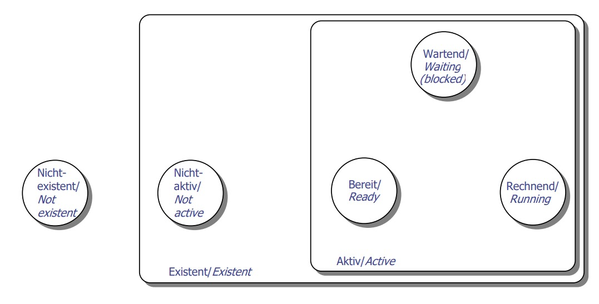

Exam
====

Aufgabe 1 (Architektur, 8 Punkte)
---------------------------------

Task
~~~~

Name all of the four service layers of the process area and all of the four service layers of the kernel area for the microkernel operating system. For each of the layers, specify at least one service that it provides for the layer above.

.. image:: exam2.jpeg

Answer
~~~~~~

- **Process Area**
	- **7 Management of logical resources**
		- Verwaltung logischer Ressourcen auf Systemebene
		- Dateisystemhierarchie oder Zugriffskontrolle für Dateien
	- **6 Operation of logical resources**
		- Zugriff auf virtuelle Ressourcen (auf virtuelle Version einer Ressource)
		- z.B. Lesen/Schreiben einer Datei
	- **5 Management of real resources**
		- Sitzt zwischen Anfrage und Operation
		- Entscheidet wer wann zugreifen darf
	- **4 Operation of real resources**
		- Steuert Hardware, schreibt, liest, interrupted, etc.
- **Kernel Area**
	- **3 Kernel operations**
		- Nimmt Anfragen an Kernel an und verarbeitet sie
		- z.B. Erstellen von Prozessen
	- **2 Process state change operations**
		- Ändern von Status von Prozessen
	- **1 Data structure operations**
		- Verwaltet und speichert z.B. Prozesse
	- **0 Kernel memory management**
		- Manipulieren von Speichereinträgen

Aufgabe 2 (Gerätebetrieb, 4 Punkte)
-----------------------------------

Task
~~~~

Explain briefly the terms **Programmed I/O** and **DMA**.

Answer
~~~~~~

- **Programmed I/O**
	- Datenübertragung erfolgt direkt zwischen CPU und I/O-Gerät. CPU steuert Übertragung vollständig und prüft das Gerät aktiv. (Ständiges Polling, CPU blockiert, hohe Last.) Leicht implementiert, keine extra Hardware. CPU checkt ständig das Statusregister des I/O-Gerätes. Nicht sehr effizient.
- **DMA (Direct Memory Access)**
	- I/O-Geräte können direkt ohne Umweg über die CPU auf Hauptspeicher zugriefen, ohne CPU Beteiligung. CPU dadurch entlastet. Nach fertiger Operation wird ein Interrupt an CPU geschickt.
- **Memory mapped I/O**
	- Prozessor kontrolliert I/O-Geräte durch Arbeitsspeicher. Speicherzellen des I/O-Gerätes werden auf Hauptspeicher gemapped, damit kann die CPU diese indirekt manipulieren.

Aufgabe 3 (Prozessumschaltstrategien, 12 Punkte)
------------------------------------------------

Task
~~~~

Which of the introduced scheduling approaches would you use in the following scenarios? Give reasons for your answer based on the properties of the chosen scheduling approach.

a. A fixed number of compute jobs with given service times have to be scheduled in order to get the minimum of the average response time
b. The compute power of the processor as resource of a multi-user operating system should be distributed fairly between all of the threads. A fair distribution is reached when the response time of a thread is proportional to the service time of the thread
c. In an operating system for batch-job execution priorities are used to sort the execution sequence of the threads. The execution should be strictly bound to the priority.
d. Arbitrary compute jobs with known service time are created at different times. The jobs have to be executed in order to minimize the average response time and without starvation of a job.

Answer
~~~~~~

.. warning:: TODO: Learn sheduling algorithms

Aufgabe 4 (Prozesse, 10 Punkte)
-------------------------------

Task
~~~~

For the given state diagram of a microkernel operating system name the state transitions by specifying from which state to which other state the transition is performed. Briefly describe the state transition considering the data structures and the appropriate operations.

Please use the following abbreviations to describe the states:

- A - Not existent
- B - Not active
- C - Ready
- D - Running
- E - Waiting (Blocked)

Answer
~~~~~~

.. warning:: TODO: Description

**Hinrichtung**

::
	not existent		--create-->		not active
	not active		--activate-->		ready
	ready			--assign-->		running
	running			--block-->		waiting (blocked)
	waiting (blocked)	--deblock-->		ready

**Rückrichtung**

::
	running			--relinquish-->		ready
	ready			--deactivate-->		not active
	not active		--delete-->		not existent

Aufgabe 5 (Prozesswechsel, 10 Punkte)
-------------------------------------

Task
~~~~

Name at least four occasions that may lead to a process switch.
Discuss for these different events the usefulness to design a scheduling which implements responsiveness and fairness.

Answer
~~~~~~

.. warning:: TODO: Discuss

- Preemptive scheduling
- I/O-Warten (blockieren) Prozess gibt ab
- Prozess wird beendet/beendet sich
- Erhöhung der Priorität eines wartenden Threads

Aufgabe 6 (Kommunikation, 10 Punkte)
------------------------------------

Task
~~~~

How can channel objects be connected (bound) to threads? Name pro and con for every method.

Answer
~~~~~~

.. warning:: TODO

Aufgabe 7 (Thread-Interaktionsmechanismen, 4 Punkte)
----------------------------------------------------

Task
~~~~

Which parts of a monitor as a mechanism for protecting a critical section of a parallel
program must be provided by the operating system? Are there parts that cannot be
provided by the operating system? Give reasons for you answer.

Answer
~~~~~~

.. warning:: TODO

Aufgabe 8 (Virtueller Speicher, 6 Punkte)
-----------------------------------------

Task
~~~~

a. In classic variants of virtual memory management, a distinction is made between segments and pages. When does this distinction make sense? Give reasons for you answer.
b. In the ARM architecture, the processes' page tables are located at virtual addresses. What are the advantages of managing page tables at virtual addresses instead of physical addresses in main memory?

Answer
~~~~~~

.. warning:: TODO

Aufgabe 9 (Hauptspeicherverwaltung, 10 Punkte)
----------------------------------------------

Task
~~~~

Name and describe one strategy for thrashing prevention. The description has to cover the data necessary for the strategy, how the data is collected and the detection of the thrashing situation.

Answer
~~~~~~

.. warning:: TODO

Aufgabe 10 (Verklemmungen, 8 Punkte)
------------------------------------

Task
~~~~

a. Name all of the four requirements for a deadlock!
b. What's the difference between deadlock prevention and deadlock avoidance?
c. Name a strategy for deadlock prevention and give reasons which requirement named under a) will not occur!
d. A memory location in the physical address space can be considered to be a resource. What are the circumstances that prevent a deadlock? Give reasons for your answer.

Answer
~~~~~~

a. All requirements for a deadlock
	1. Mutual exclusion
		- Eine Ressource kann nur von einem Prozess zur gleichen Zeit genutzt werden. Resources are used exclusively
	2. Hold and wait
		- Prozesse die schon Ressourcen besitzen fordern eine weitere an, während sie die die sie schon haben halten. Threads or processes hold allocation of a resource, and try to alocate another
	3. No preemption
		- Eine Ressource kann nur vom Prozess freigegeben werden, nicht von einem verwaltenden System. There is no preemption (resources cannot be taken away forcibly)
	4. Circular wait
		- Eine Kette von Prozessen existiert, bei der jeder Prozess eine Ressource hält, die vom nächsten Prozess in der Kette benötigt wird. A cycle in the wait-for graph
b. Difference between deadlock prevention and deadlock avoidance
	- Prevention
		- Pre-claiming
			- All resources needed by a thread are requested (and allocated) at starting time
			- Hold and wait can't occur
			- Difficult in dynamic systems
			- Uneconomical approach as resources are occupied longer than needed
		- Overall release at request
			- Hold and wait can't occur
		- Allocation by (given) order
			- Resource allocation is performed in order only
			- Circular wait can't occur
			- Cycles in wait-for graph are prevented
	- Avoidance
		- Bankiersalgorithmus
		- Wenn es eine Reihenfolge gibt wie alle satisfied werden können -> safe, sonst -> unsafe
		- In case a request would lead to an unsafe situation -> postpone request
	- Detection
		- In case avoidance can't be performed (weil wir nicht genug über das System wissen (remaining requests unknown))
		- Occurence has to be detected at least
		- Bankiersalgorithmus auf CURRENT requests, können dann dort deadlock detecten
	- Resolution/Recovery
		- Cut cycle in wait-for graph
		- In case we can't withdraw a resource -> kill thread -> which one?
	- So the difference between prevention and avoidance:
		- **Prevention:** Maßnahmen ergreifen, dass es in einem System nie zu einem Deadlock kommen kann
		- **Avoidance:** Im momentanen Zustand des Systems Maßnahmen ergreifen, dass es nicht zu einem Deadlock kommen *wird*, auch wenn es theroetisch möglich ist (z.B. durch falsch Reihenfolge von Requests annehmen -> Bankiersalgorithmus gibt den richtigen an)
c. Name a strategy for deadlock prevention and give reasons which requirement named under a) will not occur!
	- **Overall release at request:** Eine Resource freigeben wenn sie angefordert wird, so wird es nicht zu einem Kreis im wait-for Graphen kommen
d. A memory location in the physical address space can be considered to be a resource. What are the circumstances that prevent a deadlock? Give reasons for your answer.
	- Wenn dieses Betriebsmittel nicht nur von einem Thread at a time genutzt werden kann. Deadlocks treten nur auf, wenn mehrere Threads auf eine Resource zugreifen, auf die nur ein Thread gleichzeitig zugreifen darf. Also: Wenn keine mutual exclusion für diese Resource gebraucht wird.

Aufgabe 11 (Gerätebetrieb, 6 Punkte)
------------------------------------

Task
~~~~

The queue of a hard disc system contains the following requests. Use the given strategies to process the requests. Explain the plan of request processing according to the specified strategies.

The strategies are:

a. FCFS (First-Come-First-Served),
b. SSTF (Shortest-Seek-Time-First),
c. SCAN (Fahrstuhlstrategie/Elevator strategy),
d. SCAN-C (Zyklische Fahrstuhlstrategie/Cyclic Elevator strategy).

The queue contains:

61, 23, 45, 10, 97, 53, 22, 49, 83, 24

The current position of the head (read/write) is 52 and the head is moving upwards.

Answer
~~~~~~

.. warning:: TODO

Aufgabe 12 (Dateisysteme, 9 Punkte)
-----------------------------------

Task
~~~~

A current challenge related to file systems is to keep them in a consistent state even after the system has crashed.

Name three solutions and describe why they significantly reduce the effort for restoring the consistency of the file system compared to a classic file system.

Answer
~~~~~~

.. warning:: TODO

Aufgabe 13 (Leistungsmodellierung, 3 Punkte)
--------------------------------------------

Task
~~~~

What is Littles Law?

Answer
~~~~~~

.. warning:: TODO

Zusatzaufgabe (Betriebssystemfunktionen, 2 Zusatzpunkte)
--------------------------------------------------------

Task
~~~~

The exercises gave you the opportunity to implement an operating system providing the following properties: device management without and with interrupts, interrupt and exception handling, thread management and thread switching including a simple scheduling, separation of the kernel and introduction of a kernel interface, separated process address spaces using the MMU. What task would you go on next? Give reasons for you answer.

Answer
~~~~~~

.. warning:: TODO