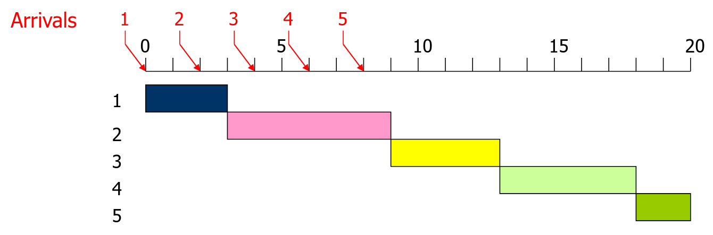
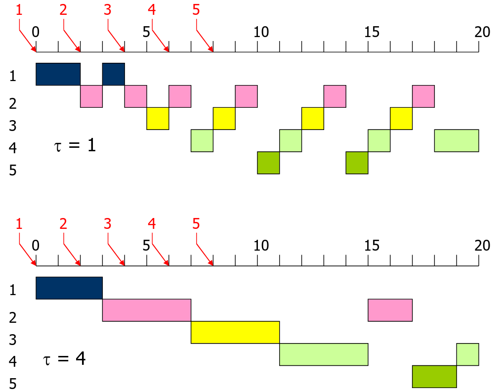
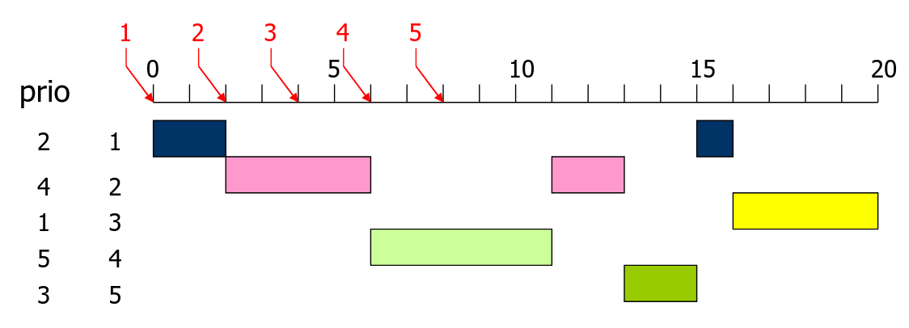
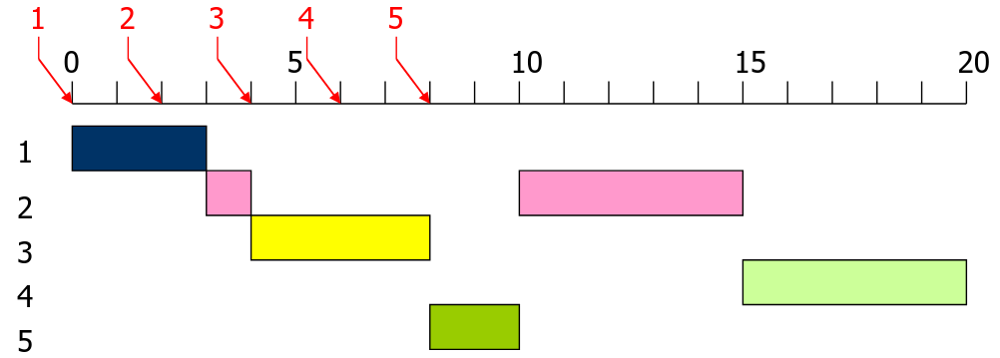
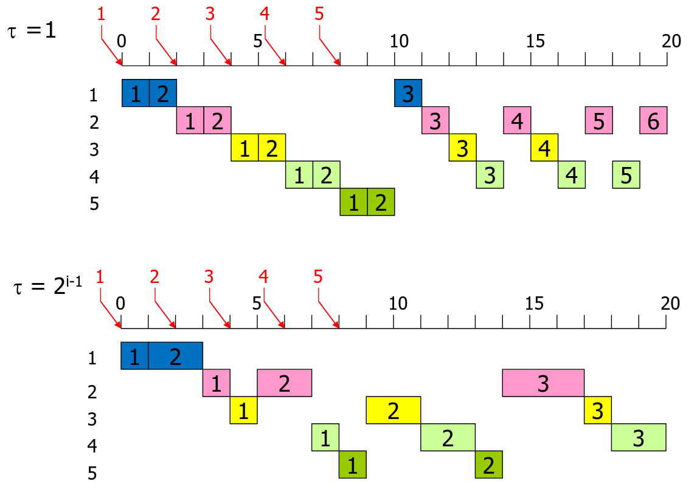

Lecture 3 - Scheduling
======================

.. epigraph::

	Furious activity is no substitute for understanding.
	*Blanker Aktionismus ist kein Ersatz für grundlegendes Verständnis.*

	-- H. H. Williams

Overview
--------

Scheduling means timely planning an activity that might be in connection to a resource.

In operating systems, usually the assignments of threads or processes.

This scheduling can be found in different granularity levels on OS:

- When do we start a program? The processes and threads should be assigned to a CPU
- Threads as pieces of a parallel program have to be executed on a prallel computer
- In digital systems (inside the CPU, hardware level), pipelining, superscalar architectures, ...

Examples
--------

- Multi-user OS: Several threads are ready to run, which one should be executed next?
- How should a compiler build the instructions so a superscalar processor can use the pipelines efficiently?
- In a single user system an MPEG-video is played live from the Internet. The interplay of networking software, decoding, presentation at the display and output to speakers have to cooperate with each other to display a smooth video, even with other background processes.
- 2 more examples

Classic scheduling problem
--------------------------

We have threads for which processing we need a CPU. How do we allocate 6 Threads to 3 processors?

Problem variants
----------------

- Monoprocessor/Multiprocessor
	- Different processors could have different processing power
- Thread set static or dynamic?
	- In the dynamic case new threads may arrive at any time during the execution
- Scheduling on-line (at runtime) or off-line (prior to runtime)?
	- Do we schedule at runtime or before that? Maybe we don't know about how many threads we get and their processing time, priorities, etc.
- Execution times known in advance?
	- Known execution times of threads are a prerequisite for real-time scheduling and helpful for algorithms
- Preemption possible?
- Dependencies between threads
- Communication times to be considered?
- Set-up times (e.g. switching) considered?
- Priorities considered? Could be static or dynamic
- Deadline to be considered? (Real-time systems)
- Which goal should be achieved?
	- Objective function to be maximized

Examples for Goals
------------------

- User-oriented goals
	- Makespan (length of schedule)
	- Maximum response time
	- Mean (weighted) response time
	- Maximum lateness
	- ...
- System-oriented goals
	- Number of processors
	- Throughput
	- Processor utilization
	- ...

General aspects
---------------

We want to focus on these goals:

- High efficiency -> processor highly utilized
- Low response time -> with interactive programs
- High throughput -> batch-processing
- Fairness and capacity -> fair distribution of processor and waiting times to the threads

Scheduling Levels
-----------------

We will mostly do short-term scheduling.

Mid-term scheduling decided what threads come into the sytem and are being activated.

Long-term scheduling decides how applications come into the system as to be managed as threads.

Scheduling for Multiprogramming
-------------------------------

- Assumptions
	- Homogenous (symmetric) multiprocessor systems
	- Dynamic set of threads
	- No dependencies between threads (for now)
	- Dynamic on-line scheduling
	- No deadlines
- Strategic alternatives
	- with/without preemption
	- with/without priorities
	- dependent/independent of service time - do we know service time? do we consider them?

Scenario for dispatching strategies
-----------------------------------

*slide 4-11*

We have a set of processors and a set of ready TCBs. We want to assign the threads to the processors. Where do the threads access the system? Our scheduling algorithm will decide.

Standard strategies
-------------------

- **FCFS**      First Come First Served
- **LCFS**      Last Come First Served
- **LCFS-PR**   Last Come First Served-Preemptive Resume
- **RR**        Round Robin
- **PRIO-NP**   Priorities (non-preemptive)
- **Prio-P**    Priorities (preemptive)
- **SPN**       Shortest Process Next
- **SRTN**      Shortest Remaining Time Next
- **HRRN**      Highest Resposne Ratio Next
- **FB**        Multilevel Feedback

**FCFS** - First Come First Served
------------------------------

Execution of threads in the order of arrival at the ready list, occupation of processor until end of process or voluntary yield.

**LCFS** - Last Come First Served
-----------------------------

Execution of threads in reversed order of arrival at the ready list. Occupation of processor until end or voluntary yield.

.. image:: 3lcfs.png

**LCFS-PR** - Last Come First Served - Preemptive Resume
--------------------------------------------------------

Newly arriving thread at ready list preempts the currently running thread. Preempted thread is appended to ready list. In case of no further arrivals, the ready list is processed without preemption.

Goal is to prefer short threads, these have a good chance to finish before another thread arrives. A long thread is likely to be preempted several times.

.. image:: 3lcfs-pr.png

**RR** - Round Robin (time slicing)
-----------------------------------

Processing of thread in order of arrival. After some prespecified time (time slice τ) preemption takes place and we switch to the next thread.

Goal is the even distribution of processor capacity and waiting time to the competing threads. Selection of τ is an optimization problem, because:

- For larger τ, RR approaches FCFS
- For small τ, the overhead of frequent switching is a performance penalty

Usual are time slices in the order of some tens of milliseconds.

**PRIO-NP** - Priorities - nonpreemptive
----------------------------------------

Newly arriving threads are inserted in the ready list according to their priority. Once assigned, they stay running on the processor until they finish or voluntarily relinquish the processor.

.. image:: 3prio-np.png

**PRIO-P** - Priorities - preemptive
------------------------------------

Like PRIO-NP except that we check for preemption, i.e. the running thread is being preempted if it has a lower priority than the new thread.

**SPN** - Shortest Process Next
-------------------------------

Thread with shortest service time is executed next until it finishes. Like PRIO-NP, if we consider service time as priority criterion.

Favors short threads and thus leads to shorter mean response time than FCFS. Also known as Shortest Job Next (SJN).

.. image:: 3spn.png

**SRTN** - Shortest Remaining Time Next
---------------------------------------

Thead with shortest remaining service time is executed next. Currently running thread may be preempted.

Both strategies have disadvantage that they need a-priori knowledge of service times that may be available only as users estimates. Long threads may starve when always shorter threads are available.

**HRRN** - Highest Response Ratio Next
--------------------------------------

The response ratio *rr* is defined as:

.. math::

	\text{rr} := \frac{\text{waiting time + service time}}{\text{service time}}

*rr* is calculated dynamically and used as priority: The thread with the highest *rr*-value is selected. The strategy is non-preemptive.

As with SPN short threads are favoured. However, long threads do not need to wait forever but score some points by waiting.

.. note::

	What about the "beginning"? When all threads have a waiting time of 0? Then all the *rr*s should be exactly 1. So we just do FCFS?

.. image:: 3hrrn.png

**FB** - (Multilevel) Feedback
------------------------------

If we do not know the service time a priori, but want to favor short threads we can reduce its "priority" stepwise at each CPU-usage. The individual waiting queues can be managed according to "round robin". Different  values of time slices τ for the individual queues are possible.

.. image:: 3fb1.png

Standard strategies (summary)
-----------------------------

.. raw:: html

	<table border="1">
		<tr>
			<th rowspan="2"></th>
			<th colspan="2">without preemption</th>
			<th colspan="2">with preemption</th>
		</tr>
		<tr>
			<th>without priorities</th>
			<th>with priorities</th>
			<th>without priorities</th>
			<th>with priorities</th>
		</tr>
		<tr>
			<td>Service time independent</td>
			<td><b>FCFS, LCFS</b></td>
			<td><b>PRIO-NP</b></td>
			<td><b>LCFS-PR, RR, FB</b></td>
			<td><b>PRIO-P</b></td>
		</tr>
		<tr>
			<td>Service time dependent</td>
			<td><b>SPN, HRRN</b></td>
			<td></td>
			<td><b>SRTN</b></td>
			<td></td>
		</tr>
	</table>

Scheduling with priorities
--------------------------

- Static priorities express the absolute importance of a task
	- A task is never executed as long as there is a task with a higher priority
	- Subject to priority inversion
	- Easy to implement, low overhead, usually O(1) complexity
- Dynamic priorities are a bit less strict
	- Scheduler does consider priority, but also adapts priority over time (e.g. waiting time)
	- Depending on how priority is adjusted, certian effects can be achieved
		- Priority inversion can be avoided
		- Short running tasks can get preferences over long running tasks
	- Can be realized on top of an implementation of static priorities

Priority Inversion
------------------

Using priorities can lead to priority inversion.

*slide 4-32*

If a thread *A* has priority 4 and holds a resource *R*.
If there is a thread *B* with priority 8.
If there is a thread *C* with priority 12 which waits for *R*.

Then *C* would be currently running because it has the highest priority. But *C* blocks, because it waits for *R*. *R* can't be free'd, because *A* has to "finish" using it, but *A* isn't running, because it's priority is lower than *B*.
*C* is now blocking, but *A* still can't run, because *B* has a higher priority.

Thats a problem. The highest priority thread isn't chosen to run. *C* won't starve, because eventually, *B* will be done, but still, we didn't respect the priorities.

Solution?

Priority inheritance
--------------------

We pass priority to the thread that holds the resource that the highest priority thread waits for.

Thread *A* "inherits" the priority of thread *C*.

Estimating the duration of computing phases
-------------------------------------------

- For the scheduling strategies service time not necessarily means total service time, it can also relate to the compute time between two I/O-activities.
- This is sometimes called "CPU burst"
- The compute phases often follow other statistical distributions than the total service times
- Threads often show some "stationary" behaviour, i.e. the behaviour of the most recent past is a good predictor ofr short-term future.

Case studies
------------

Unix
~~~~

Feedback which has user threads from 0 to n and system threads from -1 to -m, with -m being the highest priority. RR in each priority class.

